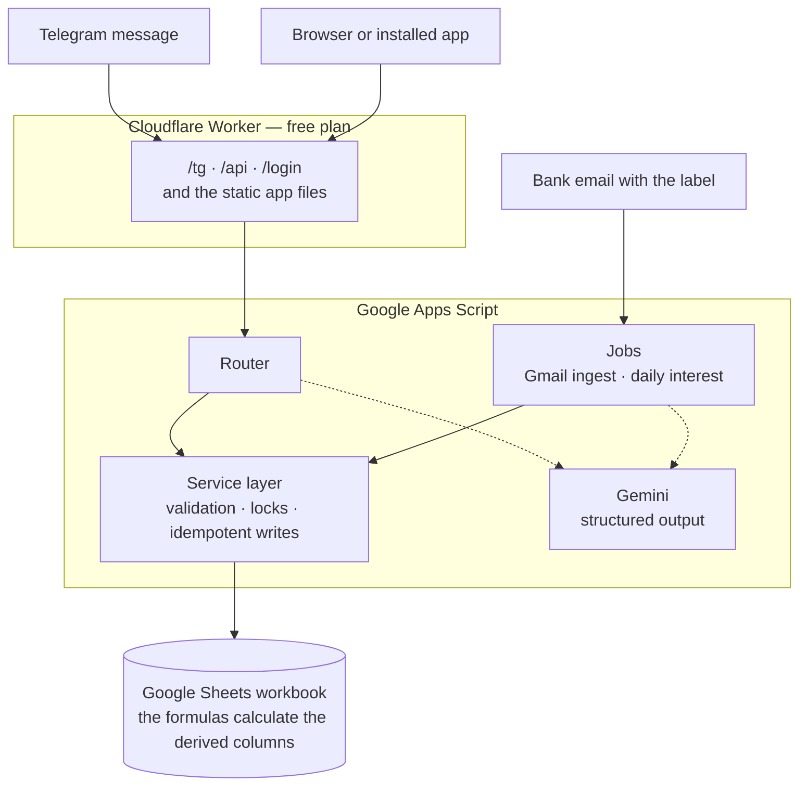

# FinanceTracker

> A personal finance system with three ways in, no server to maintain, and no monthly cost.

Send a message to a Telegram bot, open an installable web app, or do nothing and let the system read your bank emails. All three write to one Google Sheets workbook through the same service layer. In daily personal use since November 2025.

**Google Sheets · Apps Script · Cloudflare Workers · Gemini · Telegram · plain JavaScript · zero runtime dependencies**

This README is for a person. `CLAUDE.md` is the document for AI assistants. The style is Simplified Technical English (ASD-STE100). Keep that style.

---

## What it does

- **Telegram bot.** Send "coffee 120 maya". The bot writes the row and answers with a receipt that has an **Undo** button. One message can hold more than one transaction. The bot also answers `/balance` and questions such as "how much on food this month".
- **Progressive web app.** Eight screens. You can install it on a phone, and you can record a transaction offline. The app sends the record when the connection comes back.
- **Gmail ingest.** Each 5 minutes, a job reads the emails with the `Finance Tracker` label, records each transaction, then moves the email to the trash. To add a bank, change the Gmail filter, not the code.
- **Two more parts.** A daily job records the interest of each account. A Tax screen collects the data for the Philippine BIR 8 percent regime.

## Architecture



The service layer owns each write. The bot, the app and the two jobs use the same functions, the same validation and the same lock. Thus there is one place to correct a rule.

## Engineering decisions

**The Worker exists because Telegram refuses a redirect.** The first version sent the webhook to Apps Script. The bot answered again and again. `getWebhookInfo` gave the cause: `"Wrong response from the webhook: 302 Found"`. Apps Script always answers a POST with a redirect. A 15-line Worker now answers Telegram with the code 200, then sends the message to Apps Script.

**The same Worker supplies the app.** A proxy is necessary in all conditions, because Apps Script cannot send CORS headers. Thus the app and the API are on the same origin, and a write does not need a preflight request. This also made the offline function possible, because a service worker cannot operate in the Apps Script sandbox.

**The workbook calculates the derived values.** Month, Type, Segment, Currency and Amount in pesos are formulas. The code writes the input columns only, and it reads each balance from the workbook. Thus a manual correction and an API write give the same result. A test compares the two paths.

**The offline queue accepts idempotent writes only.** The app makes the identifier before the first attempt. If the connection fails after the server wrote the row, the second attempt gives the answer "duplicate", and the app counts this answer as a success. Edits and deletions refuse to operate offline, because they are not idempotent.

**One deduplication layer was not sufficient.** A deterministic row identifier stops a second row, but the check is after the slow language model call. Telegram sent the message again first. The webhook now claims the update identifier in the cache at the first line. The row identifier stops a duplicate row. The cache claim stops the storm.

**The Gmail ingest uses the bot.** The job has no parser for each bank. It sends the email to the function that reads a Telegram message, then to the same write function. Thus an email gives the same receipt and the same **Undo** button as a message that you typed.

**Infrastructure that the project removed.** The first client was an n8n workflow on a laptop, and a migration to a virtual machine started, then stopped. The bot moved into Apps Script instead, at a cost of approximately 200 lines in one file. The project thus has no virtual machine, no web server, no TLS certificates, no dynamic DNS name and no container stack.

**A feature that the data removed.** A job calculated the daily interest. The bank gave 24.50 pesos, and the job gave 25.83 pesos, because the bank does not use the daily balance multiplied by the rate. The project stopped the job for that bank. A calculation that does not agree with the bank is worse than no calculation.

## Facts

| Item | Value |
| --- | --- |
| Backend | approximately 3 700 lines of Apps Script |
| Frontend | approximately 2 850 lines, no framework and no bundler |
| Cloudflare Worker | 127 lines |
| Dependencies | none at runtime, one for development |
| Tests | 21 pure tests operate offline with `npm test`, and 7 more need the workbook |
| Releases | 30 tagged versions, each one from one command |
| Transactions | more than 1 000 |
| Monthly cost | none |

## Known limits

- **One user.** The login uses one passphrase, and the route does not limit the attempts. A second user needs a different design.
- **Each API call needs 0.5 to 2 seconds.** Apps Script must open the workbook. The cache and the offline queue hide this delay.
- **The workbook is the only copy of the data.** Google Drive keeps the version history.
- **The language model can read an email incorrectly.** Each receipt has an **Undo** button and a button that shows the source email.

---

# Maintenance

The repository is public. Do not put a secret value in a tracked file.

## Hosting locations

| Item | Where | Notes |
| --- | --- | --- |
| Workbook | Google Sheets, owner account | Apps Script is bound to it. |
| Backend and jobs | Google Apps Script | Open script.google.com, or use `npm run open`. The project id is in `.clasp.json`. |
| Web App deployment | Apps Script ▸ **Deploy** ▸ **Manage deployments** | The `/exec` URL is a secret value. The file `.deploymentid` holds the deployment id, and Git ignores it. |
| App, proxy and webhook | Cloudflare Workers, name `financetracker-telegram` | There is no custom domain. The address ends with `workers.dev`. |
| The bot | Telegram, made with **@BotFather** | |
| Gemini key | Google AI Studio | Free plan, same Google account. |
| Source code | GitHub, `akaNiknok/FinanceTracker` | `main` is the released code. `develop` is the integration branch. |

## Settings that are not in the repository

A person sets each one in a browser. If you clone the repository, you do not get them.

### Apps Script script properties

| Property | Function |
| --- | --- |
| `OWNER_EMAIL` | It identifies the owner. |
| `API_TOKEN` | The secret value for the JSON API. If you change it, set the Worker secret `GAS_URL` again. |
| `ENFORCE_TOKEN` | It enables the API guard. The value is `true`. Set `false` to disable the guard without a deployment. |
| `USD_PHP_FALLBACK` | The exchange rate to use if the live rate is not available. |
| `MONTHLY_INCOME_PHP` | The income that the percentage budget targets use. |
| `TELEGRAM_BOT_TOKEN` | The bot token from BotFather. |
| `TELEGRAM_USER_ID` | The only Telegram user that the bot answers. |
| `TELEGRAM_SECRET_TOKEN` | It must be the same as the Worker secret `SECRET_TOKEN`. |
| `GEMINI_API_KEY` | The key from Google AI Studio. |
| `WEB_APP_URL` | The `/exec` URL. It supplies the API only. Do not send a person to this address. |
| `WEBHOOK_URL` | The address of the Worker. The value must end with `/tg`. |
| `GMAIL_QUERY` | It replaces the Gmail search. Usually there is no such property, and a value here has more authority than the label. |
| `GMAIL_LAST_TS`, `TG_LAST_IDS`, `DATA_VERSION` | The code writes these values. Do not change them manually. |

To find the value of `GAS_URL`, run `tg_gasEndpoint()` in the Apps Script editor. Do not assemble the value manually.

### Cloudflare Worker secrets

Use `npx wrangler secret put <NAME>` in the `worker/` folder.

- **`GAS_URL`.** The Apps Script `/exec` URL with `&token=`. The Worker takes the base address and the token out of this value.
- **`APP_PASS`.** The passphrase of the app. The cookie holds the SHA-256 hash and is valid for one year. If you change the passphrase, each device must sign in again. Use a long passphrase, because the login route does not limit the attempts.
- **`SECRET_TOKEN`.** It must be the same as the script property `TELEGRAM_SECRET_TOKEN`.

For `npx wrangler dev`, put the same three names in `worker/.dev.vars`. Git ignores this file.

### Apps Script triggers

Add these two triggers manually in the editor. They are not in the source code.

| Function | Schedule |
| --- | --- |
| `addDailyInterestTransactions` | Each day, 05:00 to 06:00 Manila time |
| `gmail_ingest` | Each 5 minutes |

Apps Script disables a trigger after a number of failures.

### Gmail, Telegram and Sheets

- **Gmail.** The job searches for `in:inbox label:"Finance Tracker"`. To add a bank or to remove a bank, change the Gmail filter that applies the label.
- **Telegram.** To set the webhook, run `tg_setWebhook`. Run it again after you change the permitted update types, because the buttons need `callback_query`. `tg_webhookInfo` shows the delivery errors, but `tg_setWebhook` erases them. Send a test message, then read `tg_webhookInfo`.
- **Sheets.** The `Period` column must keep the plain text format, or Sheets changes `2026-Aug` into a date. The `Filed?` column in the Ledger sheet must have no checkbox and no validation rule, because it holds a BIR quarter such as `2026-Q1`.

## Routine tasks

```bash
npm test                       # 21 pure tests, no Google account necessary
npm run push                   # send the code to Apps Script
cd worker && npx wrangler dev  # operate the app and the proxy locally
```

`npm run push` does not change the live system. The triggers use the code that you sent, but the bot and the `/api` route use the deployed Web App. Thus you must deploy.

### Release procedure

Do not create a new Apps Script deployment. A new deployment has a new URL, and the Telegram webhook and the secret `GAS_URL` hold the old URL.

1. Do the work on `develop`, or on a `feature/*` branch.
2. Increase the version number in `package.json`, then commit.
3. Merge `develop` into `main`.
4. Go to `main`, then run `npm run release`.

The command sends the code to Apps Script, deploys the same deployment id, deploys the Worker, makes the tag, pushes, and makes the GitHub release. It stops if the branch is not `main`, if the working tree is not clean, or if the tag exists.

### Migration procedure

`Migration.gs` holds the migrations of the workbook schema. Each one can operate again safely, but each one changes the live workbook. Thus the owner runs `npm run push`, then runs the function in the Apps Script editor. The system uses all the current migrations.

## Fault isolation

| Indication | What to examine, in this sequence |
| --- | --- |
| The bot does not answer. | The property `TELEGRAM_USER_ID`. Then send a test message and read `tg_webhookInfo`. Then the Gemini quota in AI Studio. |
| The error "Wrong response from the webhook: 302". | The property `WEBHOOK_URL`. It must be the Worker address, and it must end with `/tg`. |
| The buttons do not operate. | Run `tg_setWebhook` again. The permitted update types do not include `callback_query`. |
| The job does not record the emails. | The Gmail filter. Then the property `GMAIL_QUERY`, which replaces the label. Then the trigger, because Apps Script can disable it. |
| The app asks for the passphrase frequently. | A person changed `APP_PASS`, or the cookie is more than one year old. |
| The app starts, but each request fails. | The secret `GAS_URL` is old, usually because a person made a new deployment. Run `tg_gasEndpoint()`, then set `GAS_URL` again. |
| The code 401 on each request. | A person changed `API_TOKEN` but not `GAS_URL`. To recover quickly, set `ENFORCE_TOKEN` to `false`. |
| A change is not in the live system. | You did not deploy. `npm run release` deploys the two halves. |
| The values in one column are incorrect. | The formula in the workbook. The code does not calculate the derived values. |

**Free plan limits.** Apps Script gives approximately 90 minutes of trigger time each day, and the Gmail job uses 6 to 10 percent. Cloudflare permits 100 000 Worker requests each day, and only `/api`, `/login` and `/tg` count. Gemini has a limit for each key.

## How to build the system again

The manifest must keep `executeAs: USER_DEPLOYING` and `access: ANYONE_ANONYMOUS`, because the Telegram webhook cannot sign in. Thus the deployment URL is a secret value, and the properties `API_TOKEN` and `ENFORCE_TOKEN` protect the API.

1. Make the workbook, then make an Apps Script project that is bound to it.
2. Run `clasp login`, put the script id in `.clasp.json`, then run `npm run push`.
3. Run the setup functions of `Migration.gs` in the editor to make the sheets.
4. Deploy as a Web App with **execute as me** and **access: anyone (anonymous)**.
5. Put the deployment id in `.deploymentid`.
6. Set each script property, then add the two triggers.
7. Make the Cloudflare Worker, set the three secrets, then run `npx wrangler deploy`.
8. Make the bot with BotFather, set the Telegram properties, then run `tg_setWebhook`.
9. Make the Gmail label and the Gmail filter.

## The files

```
*.gs                 Apps Script backend: router, service layer, bot, Gmail, jobs, tests
worker/worker.js     Cloudflare Worker: /tg, /api, /login and the static files
worker/public/       the app: index.html, app.css, app.js, sw.js, icons, manifest
release.js           the only procedure that changes the live system
test.js              the Node program that does the pure tests
icons.js             it makes the icons again from an SVG file
CLAUDE.md            the document for AI assistants
MEMORY.md            the record of the decisions and the reasons for them
```

Git ignores `.clasprc.json` (the clasp credentials), `.deploymentid` and `worker/.dev.vars`. You cannot recover them from the repository.

---

Made by [Austin G. Imperial](https://akaniknok.github.io).
