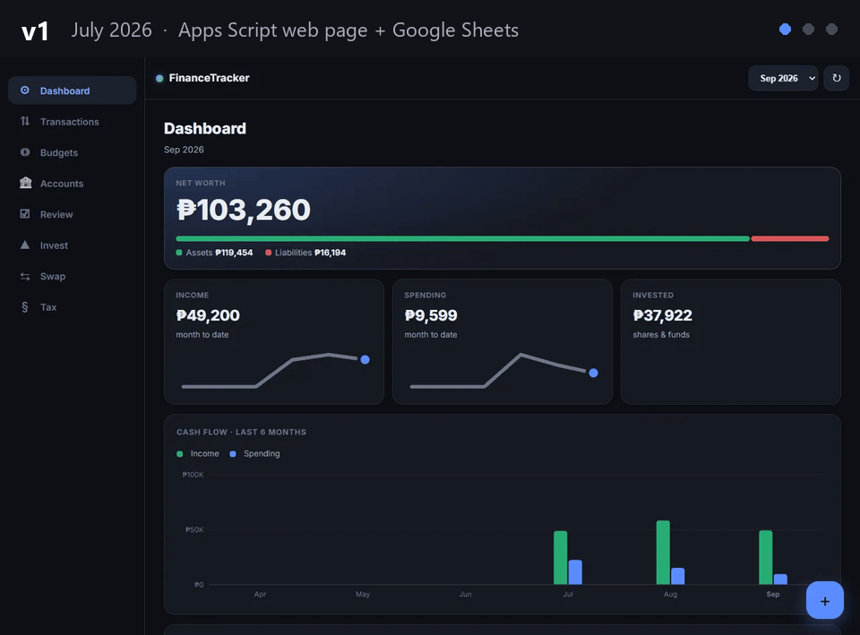
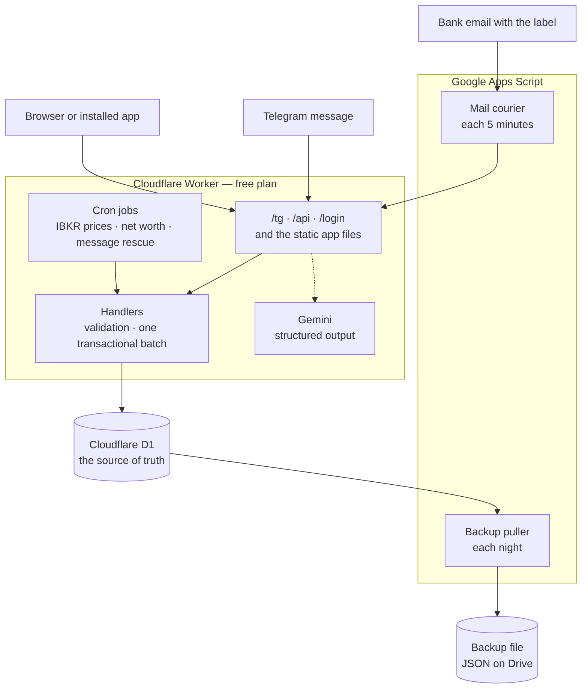

# Memento Mori

*Count the money. Remember the days.*

*Memento mori* means "remember that you will die". Your time is limited. Use your money to protect that time, not to replace it.

> A personal finance system with three ways in, no server to maintain, and no monthly cost.

<picture>
  <source media="(prefers-color-scheme: dark)" srcset="screenshots/v3-dashboard-dark.webp">
  
</picture>

Send a message to a Telegram bot, open an installable web app, or do nothing and let the system read your bank emails. All three write to one SQL database through the same handlers. In daily personal use since November 2025.

**Cloudflare Workers · Cloudflare D1 · Gemini · Telegram · Apps Script (mail only) · plain JavaScript · zero runtime dependencies**

All figures in the screenshots are invented. They come from `worker/seed.sql`, not from a real ledger.

---

## Three ways in

| You do this | The system does this |
| --- | --- |
| Send "coffee 120 maya" to the Telegram bot. | Gemini reads the message. The bot writes the row and answers with a receipt that has an **Undo** button. |
| Type in the bar at the top of the app. | The same bar adds a transaction, searches the ledger, or opens a screen. |
| Do nothing. | Your bank sends an email. Each 5 minutes, a job reads the labelled emails and records each transaction. |

<p align="center">
  <picture>
    <source media="(prefers-color-scheme: dark)" srcset="screenshots/v3-m-dashboard-dark.webp">
    
  </picture>
  <picture>
    <source media="(prefers-color-scheme: dark)" srcset="screenshots/v3-m-transactions-dark.webp">
    
  </picture>
  <picture>
    <source media="(prefers-color-scheme: dark)" srcset="screenshots/v3-m-accounts-dark.webp">
    
  </picture>
</p>

## What it does

- **Telegram bot.** One message can hold more than one transaction. The bot also answers `/balance` and questions such as "how much on food this month".
- **Progressive web app.** You can install it on a phone. You can record a transaction offline, and the app sends it when the connection comes back.
- **Gmail ingest.** To add a bank, change the Gmail filter, not the code. The job moves each email to the trash after it records the transaction.
- **Left to spend.** The Summary screen shows the money that is left in the monthly budget, and the amount for each day that keeps you on budget.
- **Net worth history.** Each day the app records the total net worth for the month. The history shows above the cash-flow chart, on the same months.
- **Retirement countdown.** The Summary screen shows the time to financial independence as years and months. The target is 25 times the yearly expenses.
- **Emergency runway.** The Summary screen shows how many months your liquid money can pay your average spend.
- **iPhone widgets.** Four home-screen widgets show the latest transactions, three account balances, the net worth and the segment targets.
- **Two more parts.** A nightly job reads the share prices from Interactive Brokers. A Tax screen collects the data for the Philippine BIR 8 percent regime.

## How it grew

The project had three lives in twelve weeks. Each version replaced the part that hurt the most.

| Version | Date | What changed |
| --- | --- | --- |
| Before v1 | November 2025 | An n8n workflow on a laptop was the Telegram bot. It read each message with Gemini and sent the row to Google Sheets through Apps Script. |
| **v1** | July 2026 | The first tagged release. Apps Script served a web page with eight screens, and Google Sheets held the data. The bot moved from n8n into Apps Script, and the Gmail ingest came next. A 15-line Cloudflare Worker started as a proxy for Telegram. |
| **v2** | August 2026 | Cloudflare D1 replaced Google Sheets. The Worker became the whole backend, and Apps Script kept the mailbox only. |
| **v3** | September 2026 | A new design: light and dark themes, the system typeface, one bar to add or search, and a new Summary screen. v3.3.0 changed the name from FinanceTracker to Memento Mori. |



Each frame shows the same invented data. The v1 frame uses the original v1.5.4 files, with a small adapter in place of Apps Script.

## Try it on your computer

The app operates locally with invented data. You need Node.js 22 or later. You do not need an account or a passphrase.

```bash
npm ci
npm run dev:seed
npm run dev
```

Open the address that `wrangler` shows. The local app skips the passphrase, and `worker/seed.sql` fills each screen. The bot and the email job need their secrets, so they do not operate locally. Run `npm test` for the 153 tests.

## Architecture



The handlers own each write. The bot, the app, the mail courier and the two jobs use the same functions and the same validation. Thus there is one place to correct a rule.

## Lessons from production

Each lesson comes from a real failure or a real measurement.

| What went wrong | What changed |
| --- | --- |
| **Telegram did not stop.** The bot got the same message again and again. Apps Script answers each POST with a `302` redirect, and Telegram counts a redirect as a failure. | A **15-line** Cloudflare Worker answered `200` first, then sent the message on. That Worker is now the whole backend. |
| **Each tap waited 0.5 to 2 seconds.** A measurement put most of the delay in Apps Script and its redirect. A faster database below Apps Script saves only 200 to 800 milliseconds. | v2.0.0 removed Apps Script from the request path and moved the data to Cloudflare D1. Apps Script now reads the mailbox only. |
| **Telegram sent a message twice.** Gemini is slow, and the duplicate check came after the Gemini call. Telegram sent the message again first. | The webhook now claims the update ID on its first line. The row ID stops a duplicate row. The claim stops the storm. |
| **A font was 72 percent of the first download.** Inter from Google Fonts was **146 KB**. The phone downloaded it again each day, and it failed with no connection. | v3 uses the system typeface of each device. The app downloads no font. |
| **A 03:00 write made the next start slow.** One version counter recorded each write. It could not say which screen changed, so the app downloaded every screen again. | Each read now carries an ETag. The server answers `304` with no content when the answer is the same. |
| **The interest job was wrong by 1.33 pesos.** The bank paid **24.50** pesos. The job calculated **25.83** pesos, because the bank does not multiply the daily balance by the rate. | v2.0.1 removed the job. A calculation that does not agree with the bank is worse than no calculation. |

**The rules that came from these lessons:**

- **Money is an integer.** Each amount is a count of millionths. A sum is exact, and one column also holds a fraction of a share.
- **The database calculates.** The month and the peso amount are generated columns. No code writes a value that it can calculate.
- **A retry never makes a second row.** The app makes the row ID before the first attempt. An offline retry gets the answer "duplicate", and the app counts that as a success.
- **One parser reads two inputs.** The email job sends the email text to the bot parser. An email gets the same receipt and **Undo** button as a typed message.
- **Each version removes infrastructure.** The project has no virtual machine, no web server, no TLS certificate and no container.

## Facts

| Item | Value |
| --- | --- |
| Backend | approximately 3 550 lines of JavaScript in the Worker |
| Database schema | 6 migration files, 12 tables and 1 view |
| Frontend | approximately 5 130 lines, no framework and no bundler |
| Apps Script | approximately 400 lines in 3 files, mail and backup only |
| Dependencies | none at runtime, one for development |
| Tests | 153 tests operate offline with `npm test`, and 107 of them use a real SQLite database |
| Releases | 87 tagged versions, each one from one merge |
| Transactions | more than 1 200 |
| Monthly cost | none |

## Known limits

- **One user.** The login uses one passphrase, and the route does not limit the attempts. A second user needs a different design.
- **The share prices are one day old.** A nightly job writes them. No page reads a price service.
- **The language model can read an email incorrectly.** Each receipt has an **Undo** button and a button that shows the source email.
- **A screen that stays open does not refresh itself.** The app revalidates a screen when you go to it.
- **The Summary screen downloads again after each write.** Each month of the Summary screen shows the live net worth, so each write changes the answer. The other screens answer 304.
- **The system does not know a corporate action.** A split of shares changes the price at IBKR and does not change the ledger. The nightly job compares the two counts and sends a message. A person corrects the earlier rows.
- **A widget tap opens Safari.** iOS has no link that opens an installed web app, so the widget opens the app address in Safari.
- **The Tax screen shows one year.** Use the year list at the top of the screen to see an earlier year.

## Operate and maintain

[HANDBOOK.md](HANDBOOK.md) is the manual for the person who operates the system. It gives the hosting locations, the secrets, the triggers, the iPhone widget setup, the release procedure, the recovery procedure and the fault isolation table. `CLAUDE.md` is the document for AI assistants.

This README uses Simplified Technical English (ASD-STE100). Keep that style.

---

Made by [Austin G. Imperial](https://akaniknok.github.io).
