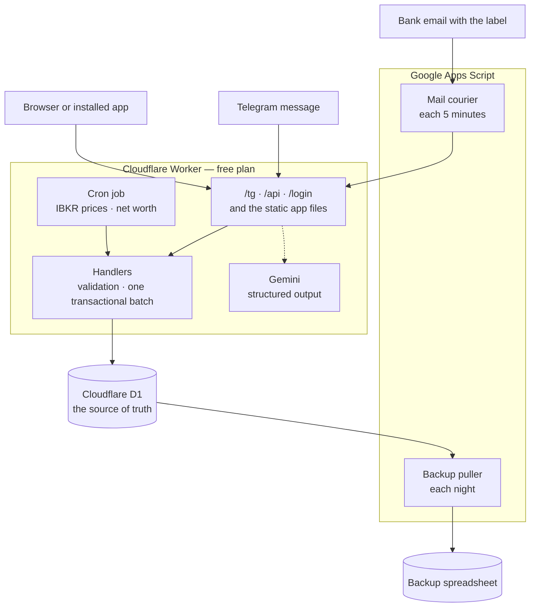

# FinanceTracker

> A personal finance system with three ways in, no server to maintain, and no monthly cost.

Send a message to a Telegram bot, open an installable web app, or do nothing and let the system read your bank emails. All three write to one SQL database through the same handlers. In daily personal use since November 2025.

**Cloudflare Workers · Cloudflare D1 · Gemini · Telegram · Apps Script (mail only) · plain JavaScript · zero runtime dependencies**

This README is for a person. `CLAUDE.md` is the document for AI assistants. The style is Simplified Technical English (ASD-STE100). Keep that style.

---

## What it does

- **Telegram bot.** Send "coffee 120 maya". The bot writes the row and answers with a receipt that has an **Undo** button. One message can hold more than one transaction. The bot also answers `/balance` and questions such as "how much on food this month".
- **Progressive web app.** Seven screens. You can install it on a phone, and you can record a transaction offline. The app sends the record when the connection comes back.
- **Gmail ingest.** Each 5 minutes, a job reads the emails with the `Finance Tracker` label, records each transaction, then moves the email to the trash. To add a bank, change the Gmail filter, not the code.
- **Net worth history.** Each day the app records the total net worth for the month. The Dashboard shows the history as a line on the cash-flow chart.
- **Two more parts.** A nightly job reads the share prices from Interactive Brokers. A Tax screen collects the data for the Philippine BIR 8 percent regime.

## Architecture



The handlers own each write. The bot, the app, the mail courier and the two jobs use the same functions and the same validation. Thus there is one place to correct a rule.

## Engineering decisions

**The Worker exists because Telegram refuses a redirect.** The first version sent the webhook to Apps Script. The bot answered again and again. `getWebhookInfo` gave the cause: `"Wrong response from the webhook: 302 Found"`. Apps Script always answers a POST with a redirect. A 15-line Worker answered Telegram with the code 200, then sent the message to Apps Script. That Worker is now the whole backend.

**The database moved because the runtime was the cost, not the storage.** A measurement showed that an API call needed 0.5 to 2 seconds, and that the Apps Script invocation and its mandatory redirect caused most of the delay. A different database below Apps Script would move only 200 to 800 milliseconds. Thus version 2.0.0 removed Apps Script from the request path and put the data in D1, on the Worker that was already deployed.

**Apps Script keeps the mailbox only.** `GmailApp` is free and permitted access to the owner mailbox, and it has no equivalent outside the platform. Thus two files stay: a courier that sends the text of each labelled email to the Worker, and a puller that writes a copy of the database into a spreadsheet each night.

**The money is an integer.** Each amount is a count of millionths of a unit. The conversion to a decimal is at the API boundary only. Thus a sum is exact, and the same column holds a fractional quantity of shares.

**The database calculates the derived values.** The reporting month and the peso amount are generated columns. The type, the segment and the currency come from a join. The balances come from two group-by queries. Thus no code writes a value that it can calculate, which is the same rule the workbook formulas gave before.

**The offline queue accepts idempotent writes only.** The app makes the identifier before the first attempt. If the connection fails after the server wrote the row, the second attempt gives the answer "duplicate", and the app counts this answer as a success. Edits and deletions refuse to operate offline, because they are not idempotent.

**One deduplication layer was not sufficient.** A deterministic row identifier stops a second row, but the check is after the slow language model call. Telegram sent the message again first. The webhook now claims the update identifier at the first line. The row identifier stops a duplicate row. The claim stops the storm.

**The Gmail ingest uses the bot.** The courier has no parser for each bank. The Worker sends the email text to the function that reads a Telegram message, then to the same write function. Thus an email gives the same receipt and the same **Undo** button as a message that you typed.

**Infrastructure that the project removed.** The first client was an n8n workflow on a laptop, and a migration to a virtual machine started, then stopped. The bot moved into Apps Script, then into the Worker. The project has no virtual machine, no web server, no TLS certificates, no dynamic DNS name and no container stack.

**A feature that the data removed.** A job calculated the daily interest. The bank gave 24.50 pesos, and the job gave 25.83 pesos, because the bank does not use the daily balance multiplied by the rate. The project stopped the job for that bank, then removed the job completely in v2.0.1. A calculation that does not agree with the bank is worse than no calculation.

## Facts

| Item | Value |
| --- | --- |
| Backend | approximately 2 000 lines of JavaScript in the Worker |
| Database schema | 156 lines of SQL, 11 tables and 1 view |
| Frontend | approximately 3 020 lines, no framework and no bundler |
| Apps Script | approximately 510 lines in 4 files, mail and backup only |
| Dependencies | none at runtime, one for development |
| Tests | 48 tests operate offline with `npm test`, and 25 of them use a real SQLite database |
| Releases | 35 tagged versions, each one from one command |
| Transactions | more than 1 000 |
| Monthly cost | none |

## Known limits

- **One user.** The login uses one passphrase, and the route does not limit the attempts. A second user needs a different design.
- **The share prices are one day old.** A nightly job writes them. No page reads a price service.
- **The language model can read an email incorrectly.** Each receipt has an **Undo** button and a button that shows the source email.
- **A screen that stays open does not refresh itself.** The app compares the data version when you go to a screen.

---

# Maintenance

The repository is public. Do not put a secret value in a tracked file.

## Hosting locations

| Item | Where | Notes |
| --- | --- | --- |
| App, API, bot and jobs | Cloudflare Workers, name `financetracker-telegram` | There is no custom domain. The address ends with `workers.dev`. Do not change the name: it is the address of the app and of the webhook. |
| Staging app | Cloudflare Workers, name `financetracker-telegram-staging` | The `develop` branch deploys here. It has no bot, no cron and no email job. The data is invented. |
| Staging database | Cloudflare D1, name `financetracker-staging` | It holds `worker/seed.sql` only. Never put real data here. |
| Database | Cloudflare D1, name `financetracker` | Region `apac`. The id is in `worker/wrangler.toml`. |
| Mail courier and backup | Google Apps Script | Open script.google.com, or use `npm run open`. The project id is in `.clasp.json`. There is no Web App deployment. |
| Backup spreadsheet | Google Sheets, owner account | The job makes it on the first night and keeps the id in a script property. |
| The bot | Telegram, made with **@BotFather** | |
| Gemini key | Google AI Studio | Free plan. |
| Share prices | Interactive Brokers Flex Web Service | See the maintenance task below. |
| Source code | GitHub, `akaNiknok/FinanceTracker` | `main` is the released code. `develop` is the integration branch. |

## Settings that are not in the repository

A person sets each one in a browser. If you clone the repository, you do not get them.

### Cloudflare Worker secrets

Use `npx wrangler secret put <NAME>` in the `worker/` folder.

| Secret | Function |
| --- | --- |
| `APP_PASS` | The passphrase of the app. The cookie holds the SHA-256 hash and is valid for one year. If you change it, each device must sign in again. Use a long passphrase, because the login route does not limit the attempts. |
| `SECRET_TOKEN` | Telegram sends this value in a header. It must be the same as the script property `TELEGRAM_SECRET_TOKEN`. |
| `TELEGRAM_BOT_TOKEN` | The bot token from BotFather. |
| `TELEGRAM_USER_ID` | The only Telegram user that the bot answers. |
| `GEMINI_API_KEY` | The key from Google AI Studio. |
| `INGEST_TOKEN` | The Apps Script jobs send this value. It must be the same as the script property of the same name. |
| `IBKR_FLEX_TOKEN` | The token of the Flex Web Service. |
| `IBKR_FLEX_QUERY_ID` | The id of the Flex query. |

For `npx wrangler dev`, put the same names in `worker/.dev.vars`. Git ignores this file.

### Apps Script script properties

| Property | Function |
| --- | --- |
| `WORKER_URL` | The address of the Worker. Do not add a path and do not add a final slash. |
| `INGEST_TOKEN` | It must be the same as the Worker secret of the same name. |
| `GMAIL_HINTS` | Text for the parser about facts that the email does not state. Usually there is no such property, and the default text in `Gmail.gs` applies. |
| `GMAIL_QUERY` | It replaces the Gmail search. Usually there is no such property, and a value here has more authority than the label. |
| `GMAIL_LAST_TS`, `BACKUP_SHEET_ID` | The code writes these values. Do not change them manually. |

### Settings in the database

The `meta` table holds the settings that were script properties before. Change them on the **Admin** screen of the app.

| Key | Function |
| --- | --- |
| `monthly_income_php` | The income that the percentage budget targets use. |
| `usd_php_fallback` | The exchange rate to use if the live rate is not available. |
| `owner_email` | It identifies the owner. |
| `data_version`, `tg_last_ids` | The code writes these values. Do not change them manually. |

### Triggers and schedules

| Job | Where | Schedule |
| --- | --- | --- |
| `gmail_ingest` | Apps Script, add it manually | Each 5 minutes |
| `backup_run` | Apps Script, run `backup_install()` one time | Each day, approximately 03:00 |
| IBKR prices | Cloudflare cron, in `wrangler.toml` | 06:00 Manila time |
| Net worth snapshot | The same Cloudflare cron, after the prices | 06:00 Manila time |

Cloudflare does not do a job again after a failure. Thus each job sends a Telegram message if it fails. Apps Script disables a trigger after a number of failures.

### Gmail, Telegram and IBKR

- **Gmail.** The courier searches for `in:inbox label:"Finance Tracker"`. To add a bank or to remove a bank, change the Gmail filter that applies the label.
- **Telegram.** To set the webhook, use the Telegram `setWebhook` method with the address `<worker>/tg`, the secret token, and the update types `message` and `callback_query`. The buttons do not operate without `callback_query`.
- **IBKR.** In Client Portal, make a Flex Query that has the Open Positions section with the fields Symbol, Position, Mark Price and Currency. Enable the Flex Web Service, then make a token with the maximum validity.

## Maintenance tasks with a date

| Task | Interval | Result of a failure |
| --- | --- | --- |
| Make the IBKR Flex token again | Each year or sooner. The maximum validity is one year. | The price job fails and sends a Telegram message. The share values become old. |

## Routine tasks

```bash
npm run bootstrap        # make a fresh clone or a new worktree runnable
npm test                 # tests, no account necessary
npm run dev              # operate the app, the API and the bot locally
npm run dev:seed         # fill the local database with invented data
npm run migrate          # apply the pending database migrations
npm run tail             # read the live Worker log
npm run tail:staging     # read the staging Worker log
npm run push             # send the two files to Apps Script
```

### The staging app

The `develop` branch deploys to a second Worker. Each push to `develop` starts the Staging workflow. The workflow applies the migrations, then deploys. Use the staging app to examine a change before you merge the release.

Staging is separate in every way that matters. It has its own database. It has no cron, so it never calls IBKR. It has no bot token and no email job. It needs one secret only:

```bash
cd worker && npx wrangler secret put APP_PASS --env staging
```

The database starts empty. Fill it from your computer:

```bash
npm run seed:staging
```

The seed is `worker/seed.sql`, which holds invented data. A normal push never reseeds, so your test data stays while you work. Use the same command again for a clean database.

The Staging workflow can also do it: select **Run workflow**, then set **reseed** to true. **GitHub shows that button only when the workflow file is on the default branch.** So the button appears after the next release moves `staging.yml` into `main`. Until then, use the command above.

**Do not copy the real data into staging.** A second copy doubles the damage if a person learns the passphrase.

### Release procedure

1. Do the work on a `feature/*` branch. Merge the branch into `develop` with a pull request.
2. Run `npm version patch` or `npm version minor` on `develop`. The command also writes the number into `worker/public/index.html`. Commit the result.
3. Run `npm run release`. The command tests the code, then opens the pull request from `develop` to `main`. It does not deploy.
4. Wait for the CI check. Then merge the pull request on GitHub.

The CI workflow tests each pull request and each push to `develop`. The `main` branch accepts only a pull request with a green check. Nobody approves the release a second time: your merge is the approval. After the merge, the Release workflow moves `develop` forward to `main` again. You can also set auto-merge on the pull request. GitHub then merges it when the check becomes green, and the release starts without you.

The merge starts the Release workflow. The workflow applies the database migrations, deploys the Worker, makes the tag, and makes the GitHub release. A merge that does not change the version does nothing. The Apps Script files are not part of this procedure. Send them with `npm run push` when you change them.

The workflow needs two GitHub repository secrets: `CLOUDFLARE_API_TOKEN` and `CLOUDFLARE_ACCOUNT_ID`. Give the token the permissions **Workers Scripts:Edit** and **D1:Edit**, and no more. The token can read all of the financial data, because it can deploy a Worker that is bound to the database. The `main` branch is protected: it accepts only a pull request, and the CI check must pass.

### Database migration procedure

Put each schema change in a new file in `worker/migrations/`, with a higher number. Do not change a file that was applied. Test with `npm run migrate:local`. The Release workflow applies it to the live database.

### How to undo a release

The code and the database do not go back together. Undo the code first.

1. Read the list of versions: `npx wrangler versions list`.
2. Put the last good version back: `npx wrangler rollback`.
3. Tell the repository what you did. Open an issue, or make the fix on a `hotfix/*` branch.

**A migration does not go back.** `npx wrangler d1 migrations apply` moves forward only. So an old Worker must still operate with the new schema. Never put a migration that removes or renames a column in the same release as the code that needs the change. Use two releases: the first adds, the second removes. If a migration destroys data, use D1 Time Travel below.

### How to recover the data

1. **D1 Time Travel.** It restores the database to a time in the last 7 days: `npx wrangler d1 time-travel restore financetracker --timestamp=<ISO time>`.
2. **The backup spreadsheet.** It holds one tab for each table, from the last night.
3. **The Admin screen.** Each table has a CSV button.

## Fault isolation

| Indication | What to examine, in this sequence |
| --- | --- |
| The bot does not answer. | The secret `TELEGRAM_USER_ID`. Then `npm run tail` while you send a message. Then the Gemini quota in AI Studio. |
| The error "Wrong response from the webhook: 302". | The webhook address. It must be the Worker address, and it must end with `/tg`. |
| The buttons do not operate. | Set the webhook again. The permitted update types do not include `callback_query`. |
| The job does not record the emails. | The Gmail filter. Then the property `GMAIL_QUERY`, which replaces the label. Then the trigger, because Apps Script can disable it. Then the property `WORKER_URL` and the two `INGEST_TOKEN` values. |
| The staging deploy fails. | The value `database_id` in the `[[env.staging.d1_databases]]` block of `worker/wrangler.toml`. A new checkout has a placeholder there. Make the database with `npx wrangler d1 create financetracker-staging --location=apac`, then write the id into the file. |
| The pull request does not merge. | The CI check on the pull request. Read the log of the failed job. The `main` branch accepts no merge before the check is green. |
| The app asks for the passphrase frequently. | A person changed `APP_PASS`, or the cookie is more than one year old. |
| The app starts, but each request fails. | `npm run tail`. Usually the D1 binding or a secret is absent. |
| The share values are 0 or absent. | The Telegram message from the price job. Then the IBKR token, because it expires. Then the `symbol` column of the account on the Admin screen. |
| A balance in pesos is absent, but the native balance is correct. | The exchange rate. Examine `usd_php_fallback` in the `meta` table. |
| A change is not in the live system. | You did not deploy. `npm run release` deploys the Worker. |
| The app shows data that is too old. | Push the refresh button. The app compares the data version on each navigation, not continuously. |

**Free plan limits.** Cloudflare permits 100 000 Worker requests each day, 5 GB in D1, 5 million read rows and 100 000 written rows each day, and 5 cron triggers. The static files do not count. Apps Script gives approximately 90 minutes of trigger time each day, and the mail courier uses 6 to 10 percent. Gemini has a limit for each key.

## How to build the system again

1. Make the D1 database: `npx wrangler d1 create financetracker --location=apac`. Put the id in `worker/wrangler.toml`.
2. Apply the schema: `npm run migrate`.
3. Set each Worker secret, then run `npm run deploy`.
4. Make the bot with BotFather, then set the webhook to `<worker>/tg`.
5. Make the Gmail label and the Gmail filter.
6. Make an Apps Script project. Run `clasp login`, then put the script id in `.clasp.json`. Enable the Apps Script API one time at script.google.com/home/usersettings. The first push fails without it. Run `npm run push`. Set the script properties. Add the `gmail_ingest` trigger, then run `backup_install()`.
7. Make the IBKR Flex query and token.
8. Open the app, then put the accounts, the categories and the budgets in the **Admin** screen.

## The files

```
worker/worker.js       the entry: /tg, /api, /login, the cron dispatch and the route tables
worker/src/            db · api · telegram · gemini · fx · jobs
worker/migrations/     the SQL schema, one numbered file for each change
worker/public/         the app: index.html, app.css, app.js, sw.js, icons, manifest
Gmail.gs, Backup.gs    Apps Script: the mail courier and the nightly backup
Export.gs              the one-time exporter of the old workbook. Remove it when it is not necessary.
migrate/               the one-time conversion of the workbook, and the API contract test
release.js             the only procedure that changes the live system
test.js, test-api.js   the Node programs that do the tests
icons.js               it makes the icons again from an SVG file
CLAUDE.md              the document for AI assistants
MEMORY.md              the record of the decisions and the reasons for them
```

Git ignores `.clasprc.json` (the clasp credentials) and `worker/.dev.vars`. You cannot recover them from the repository.

---

Made by [Austin G. Imperial](https://akaniknok.github.io).
