# Memento Mori

*Count the money. Remember the days.*

*Memento mori* means "remember that you will die". Your time is limited. Use your money to protect that time, not to replace it.

> A personal finance system with three ways in, no server to maintain, and no monthly cost.

<picture>
  <source media="(prefers-color-scheme: dark)" srcset="screenshots/v3-dashboard-dark.webp">
  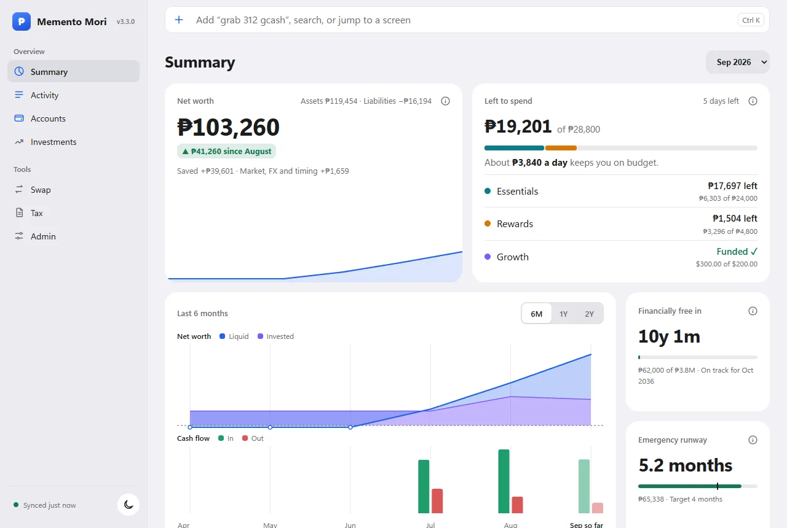
</picture>

Send a message to a Telegram bot, open an installable web app, or do nothing and let the system read your bank emails. All three write to one SQL database through the same handlers. In daily personal use since November 2025.

**Cloudflare Workers · Cloudflare D1 · Gemini · Telegram · Apps Script (mail only) · plain JavaScript · zero runtime dependencies**

All figures in the screenshots are invented. They come from `worker/seed.sql`, not from a real ledger.

---

## Three ways in

| You do this | The system does this |
| --- | --- |
| Send "coffee 120 maya" to the Telegram bot. | Gemini reads the message. The bot writes the row and answers with a receipt that has an **Undo** button. |
| Type in the bar at the top of the app. | The same bar adds a transaction, searches the ledger, or opens a screen. |
| Do nothing. | Your bank sends an email. Each 5 minutes, a job reads the labelled emails and records each transaction. |

<p align="center">
  <picture>
    <source media="(prefers-color-scheme: dark)" srcset="screenshots/v3-m-dashboard-dark.webp">
    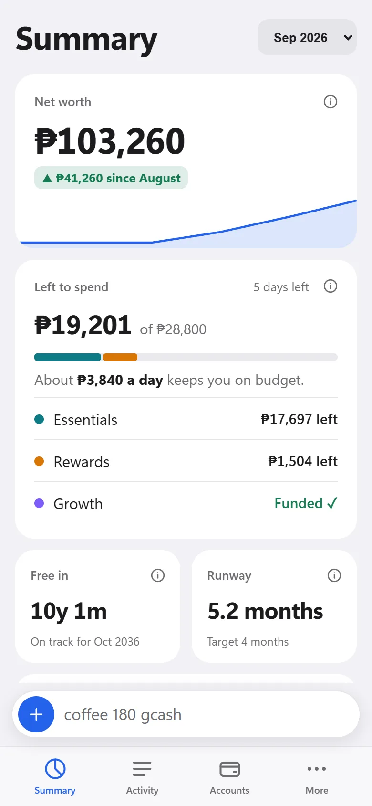
  </picture>
  <picture>
    <source media="(prefers-color-scheme: dark)" srcset="screenshots/v3-m-transactions-dark.webp">
    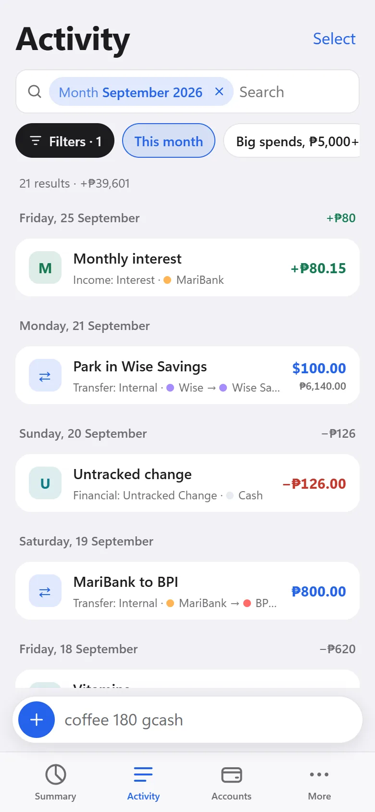
  </picture>
  <picture>
    <source media="(prefers-color-scheme: dark)" srcset="screenshots/v3-m-accounts-dark.webp">
    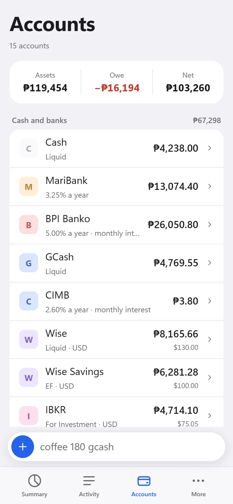
  </picture>
</p>

## What it does

- **Telegram bot.** One message can hold more than one transaction. The bot also answers `/balance` and questions such as "how much on food this month".
- **Progressive web app.** You can install it on a phone. You can record a transaction offline, and the app sends it when the connection comes back.
- **Gmail ingest.** To add a bank, change the Gmail filter, not the code. The job moves each email to the trash after it records the transaction.
- **Left to spend.** The Summary screen shows the money that is left in the monthly budget, and the amount for each day that keeps you on budget.
- **Net worth history.** Each day the app records the total net worth for the month. The history shows above the cash-flow chart, on the same months.
- **Retirement countdown.** The Summary screen shows the time to financial independence as years and months. The target is 25 times the yearly expenses.
- **Emergency runway.** The Summary screen shows how many months your liquid money can pay your average spend.
- **iPhone widgets.** Four home-screen widgets show the latest transactions, three account balances, the net worth and the segment targets.
- **Two more parts.** A nightly job reads the share prices from Interactive Brokers. A Tax screen collects the data for the Philippine BIR 8 percent regime.

## How it grew

The project had three lives in twelve weeks. Each version replaced the part that hurt the most.

| Version | Date | What changed |
| --- | --- | --- |
| Before v1 | November 2025 | An n8n workflow on a laptop was the Telegram bot. It read each message with Gemini and sent the row to Google Sheets through Apps Script. |
| **v1** | July 2026 | The first tagged release. Apps Script served a web page with eight screens, and Google Sheets held the data. The bot moved from n8n into Apps Script, and the Gmail ingest came next. A 15-line Cloudflare Worker started as a proxy for Telegram. |
| **v2** | August 2026 | Cloudflare D1 replaced Google Sheets. The Worker became the whole backend, and Apps Script kept the mailbox only. |
| **v3** | September 2026 | A new design: light and dark themes, the system typeface, one bar to add or search, and a new Summary screen. v3.3.0 changed the name from FinanceTracker to Memento Mori. |

Click a version to see it. Each version shows the same invented data.

<details>
<summary><b>v3</b> — the current design (light and dark)</summary>

<br>

<picture>
  <source media="(prefers-color-scheme: dark)" srcset="screenshots/v3-transactions-dark.webp">
  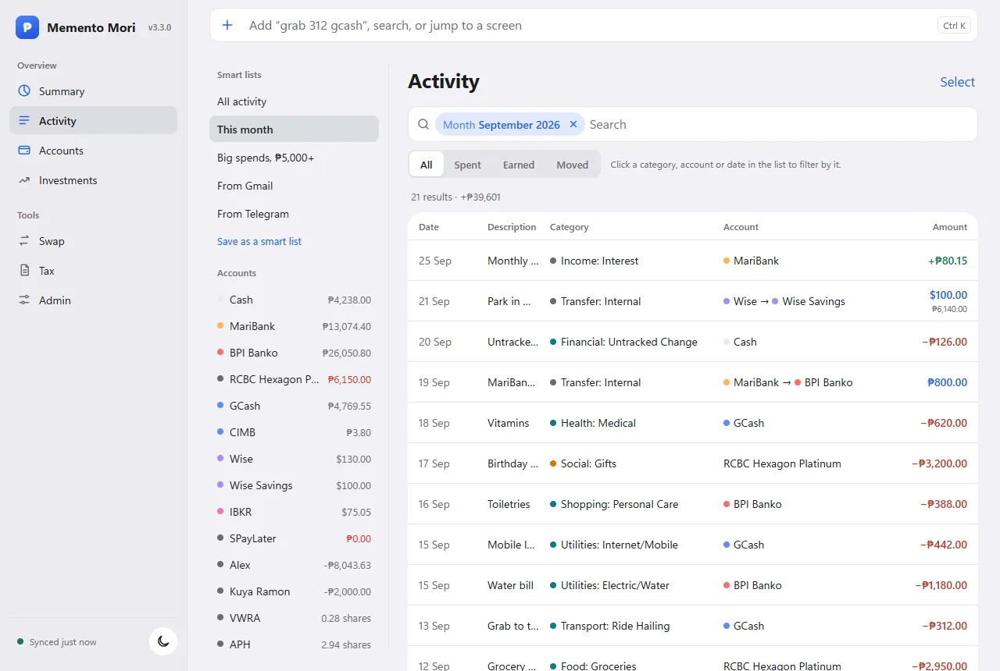
</picture>

<picture>
  <source media="(prefers-color-scheme: dark)" srcset="screenshots/v3-investments-dark.webp">
  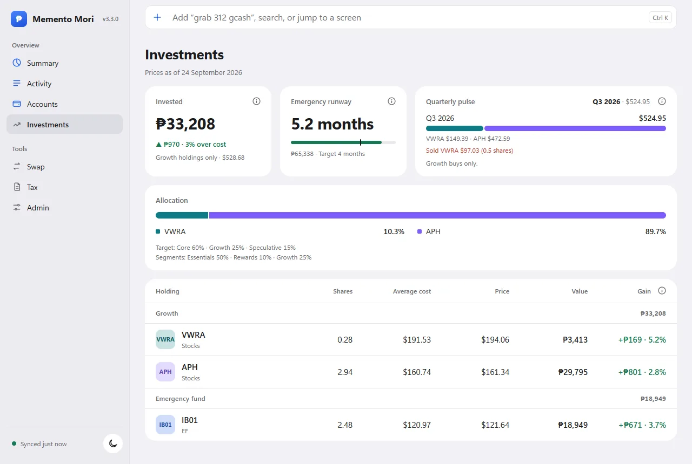
</picture>

<picture>
  <source media="(prefers-color-scheme: dark)" srcset="screenshots/v3-accounts-dark.webp">
  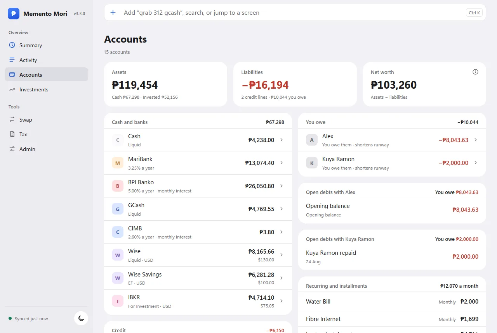
</picture>

</details>

<details>
<summary><b>v2</b> — the D1 backend, v2.16.0 (dark only)</summary>

<br>

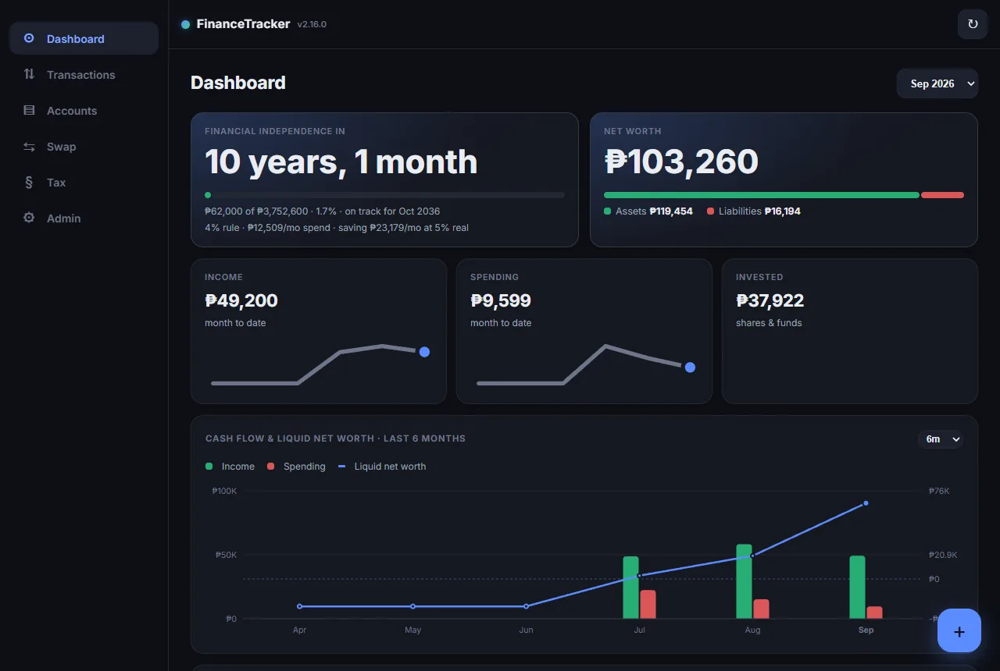

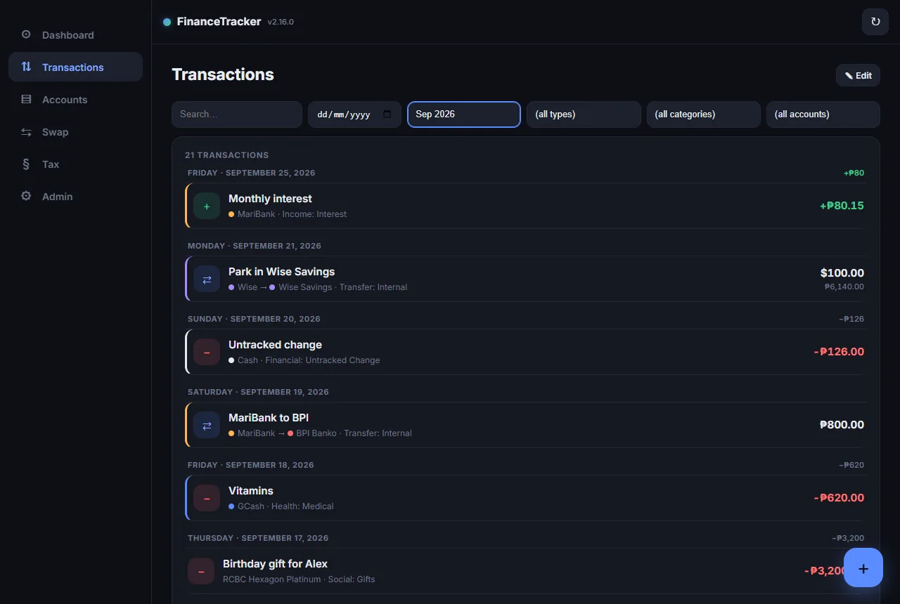

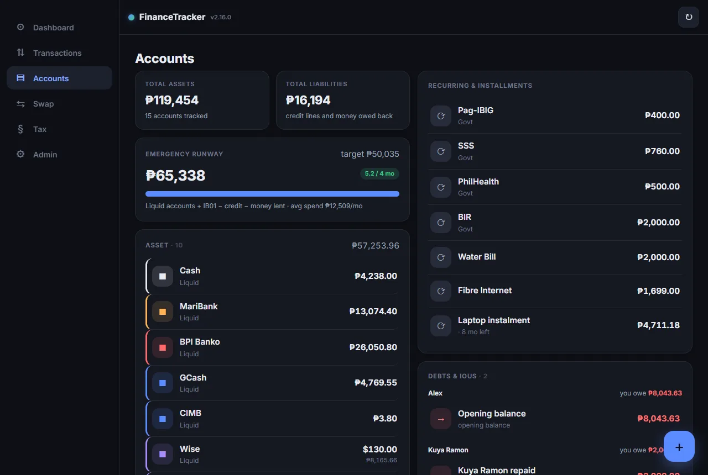

<p>
  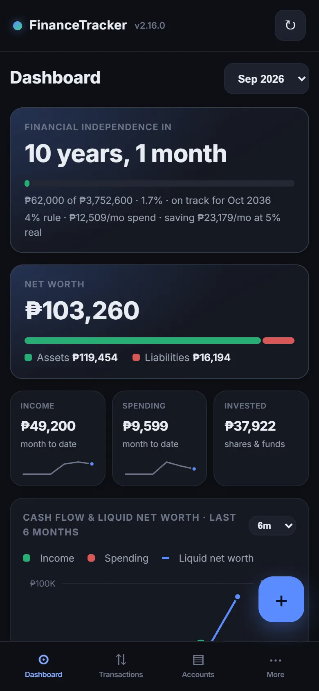
  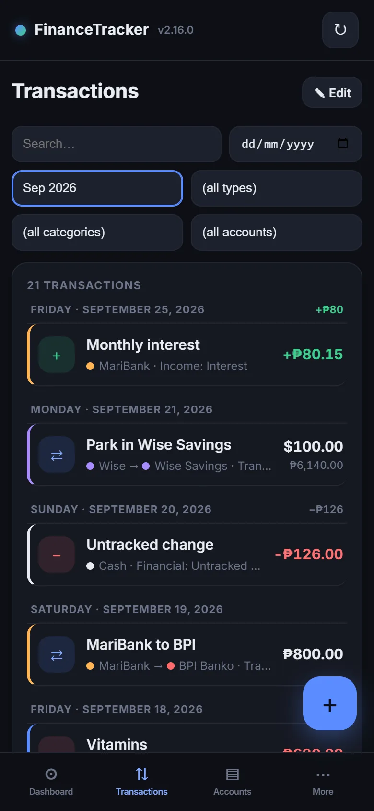
</p>

</details>

<details>
<summary><b>v1</b> — the Apps Script web page, v1.5.4 (dark only)</summary>

<br>

Apps Script served this page, and the data came from Google Sheets. The page cannot operate outside Apps Script, so these screenshots use the original v1.5.4 files with a small adapter in place of `google.script.run`.

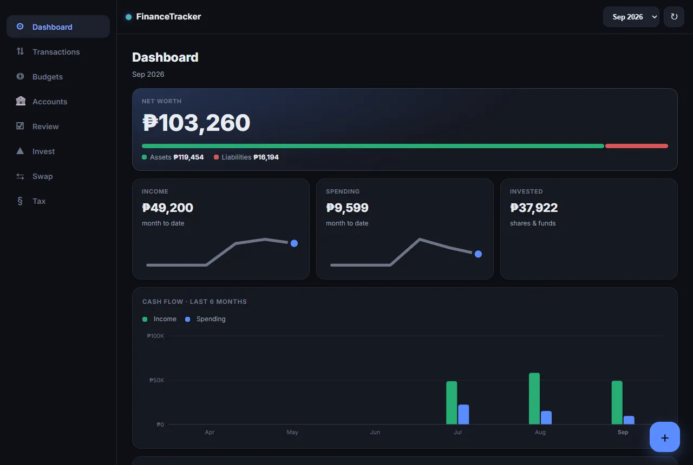

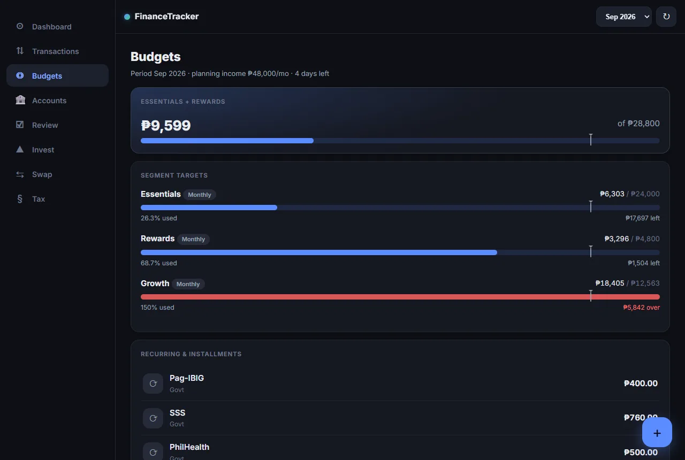

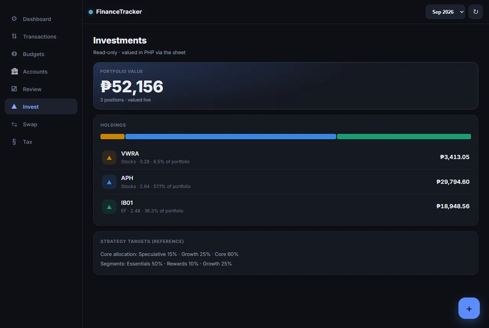

<p>
  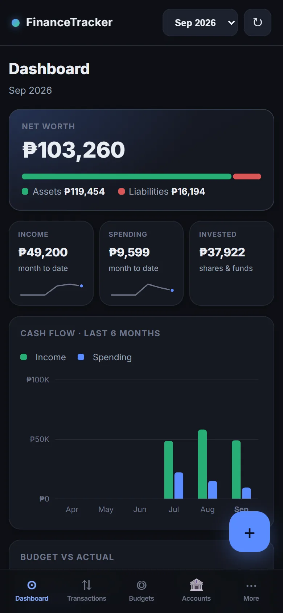
  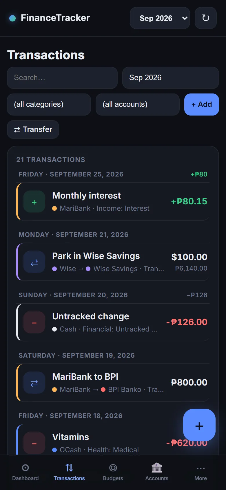
</p>

</details>

## Try it on your computer

The app operates locally with invented data. You need Node.js 22 or later. You do not need an account or a passphrase.

```bash
npm ci
npm run dev:seed
npm run dev
```

Open the address that `wrangler` shows. The local app skips the passphrase, and `worker/seed.sql` fills each screen. The bot and the email job need their secrets, so they do not operate locally. Run `npm test` for the 153 tests.

## Architecture

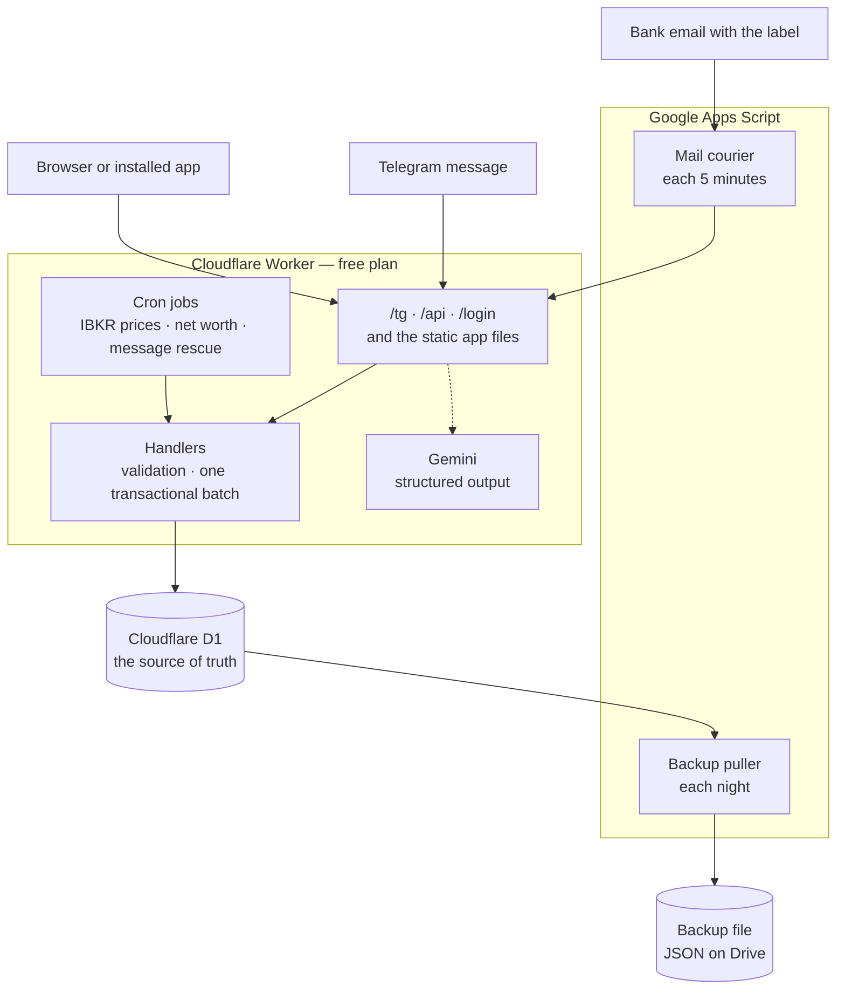
```mermaid
flowchart TB
    TG["Telegram message"]
    BR["Browser or installed app"]
    ML["Bank email with the label"]

    subgraph CF["Cloudflare Worker — free plan"]
        WK["/tg · /api · /login<br/>and the static app files"]
        SV["Handlers<br/>validation · one transactional batch"]
        JB["Cron jobs<br/>IBKR prices · net worth · message rescue"]
        AI["Gemini<br/>structured output"]
    end

    subgraph GS["Google Apps Script"]
        CR["Mail courier<br/>each 5 minutes"]
        BK["Backup puller<br/>each night"]
    end

    DB[("Cloudflare D1<br/>the source of truth")]
    SS[("Backup file<br/>JSON on Drive")]

    TG --> WK
    BR --> WK
    ML --> CR
    CR --> WK
    WK --> SV
    JB --> SV
    WK -.-> AI
    SV --> DB
    DB --> BK --> SS
```

The handlers own each write. The bot, the app, the mail courier and the two jobs use the same functions and the same validation. Thus there is one place to correct a rule.

## Engineering decisions

Each decision below comes from a real failure or a real measurement.

**The Worker exists because Telegram refuses a redirect.** The first version sent the webhook to Apps Script, and the bot answered again and again. `getWebhookInfo` gave the cause: `"Wrong response from the webhook: 302 Found"`. Apps Script always answers a POST with a redirect. A 15-line Worker answered Telegram with the code 200, then sent the message to Apps Script. That Worker is now the whole backend.

**The database moved because the runtime was the cost, not the storage.** A measurement showed that an API call needed 0.5 to 2 seconds, and that the Apps Script invocation and its mandatory redirect caused most of the delay. A different database below Apps Script would move only 200 to 800 milliseconds. Thus version 2.0.0 removed Apps Script from the request path and put the data in D1.

**Apps Script keeps the mailbox only.** `GmailApp` is free and permitted access to the owner mailbox, and it has no equivalent outside the platform. Thus two files stay: a courier that sends the text of each labelled email to the Worker, and a puller that writes a copy of the database to Google Drive each night.

**The money is an integer.** Each amount is a count of millionths of a unit, and the conversion to a decimal is at the API boundary only. Thus a sum is exact, and the same column holds a fractional quantity of shares.

**The database calculates the derived values.** The reporting month and the peso amount are generated columns. The type, the segment and the currency come from a join. The balances come from two group-by queries. Thus no code writes a value that it can calculate.

**The offline queue accepts idempotent writes only.** The app makes the identifier before the first attempt. If the connection fails after the server wrote the row, the second attempt gives the answer "duplicate", and the app counts this answer as a success. Edits and deletions refuse to operate offline, because they are not idempotent.

**One deduplication layer was not sufficient.** A deterministic row identifier stops a second row, but the check is after the slow language model call, and Telegram sent the message again first. The webhook now claims the update identifier at the first line. The row identifier stops a duplicate row. The claim stops the storm.

**The Gmail ingest uses the bot.** The courier has no parser for each bank. The Worker sends the email text to the function that reads a Telegram message, then to the same write function. Thus an email gives the same receipt and the same **Undo** button as a message that you typed. There is one parser, not two.

**The application uses the system typeface.** The first version asked Google Fonts for the font Inter. A measurement gave 146 kilobytes on a first installation, which was 72 percent of the total. The style sheet had a cache time of one day, so a phone requested it again each day, and the font also failed when the phone had no connection. The font files then moved into the repository. Version 3 removes them. The system font of each device shows the text, so the application downloads no font and the text shows with no connection.

**The cache asks the correct question.** One counter in the database recorded the version of the data. Each write increased it, and the app downloaded each screen again. An automatic write at 03:00 thus made the next start of the app expensive, because the counter cannot say which screen changed. Each read now carries an ETag, which is a hash of the answer. The app sends the tag back, and the server answers 304 with no content when the answer is the same. The tag also knows the month, the year and the page, so an old month does not download again, and no write function must remember to invalidate a cache.

**Infrastructure that the project removed.** The first client was an n8n workflow on a laptop, and a migration to a virtual machine started, then stopped. The bot moved into Apps Script, then into the Worker. The project now has no virtual machine, no web server, no TLS certificate, no dynamic DNS name and no container stack.

**A feature that the data removed.** A job calculated the daily interest. The bank gave 24.50 pesos, and the job gave 25.83 pesos, because the bank does not use the daily balance multiplied by the rate. The project stopped the job for that bank, then removed the job completely in v2.0.1. A calculation that does not agree with the bank is worse than no calculation.

## Facts

| Item | Value |
| --- | --- |
| Backend | approximately 3 550 lines of JavaScript in the Worker |
| Database schema | 6 migration files, 12 tables and 1 view |
| Frontend | approximately 5 130 lines, no framework and no bundler |
| Apps Script | approximately 400 lines in 3 files, mail and backup only |
| Dependencies | none at runtime, one for development |
| Tests | 153 tests operate offline with `npm test`, and 107 of them use a real SQLite database |
| Releases | 87 tagged versions, each one from one merge |
| Transactions | more than 1 200 |
| Monthly cost | none |

## Known limits

- **One user.** The login uses one passphrase, and the route does not limit the attempts. A second user needs a different design.
- **The share prices are one day old.** A nightly job writes them. No page reads a price service.
- **The language model can read an email incorrectly.** Each receipt has an **Undo** button and a button that shows the source email.
- **A screen that stays open does not refresh itself.** The app revalidates a screen when you go to it.
- **The Summary screen downloads again after each write.** Each month of the Summary screen shows the live net worth, so each write changes the answer. The other screens answer 304.
- **The system does not know a corporate action.** A split of shares changes the price at IBKR and does not change the ledger. The nightly job compares the two counts and sends a message. A person corrects the earlier rows.
- **A widget tap opens Safari.** iOS has no link that opens an installed web app, so the widget opens the app address in Safari.
- **The Tax screen shows one year.** Use the year list at the top of the screen to see an earlier year.

## Operate and maintain

[HANDBOOK.md](HANDBOOK.md) is the manual for the person who operates the system. It gives the hosting locations, the secrets, the triggers, the iPhone widget setup, the release procedure, the recovery procedure and the fault isolation table. `CLAUDE.md` is the document for AI assistants.

This README uses Simplified Technical English (ASD-STE100). Keep that style.

---

Made by [Austin G. Imperial](https://akaniknok.github.io).
